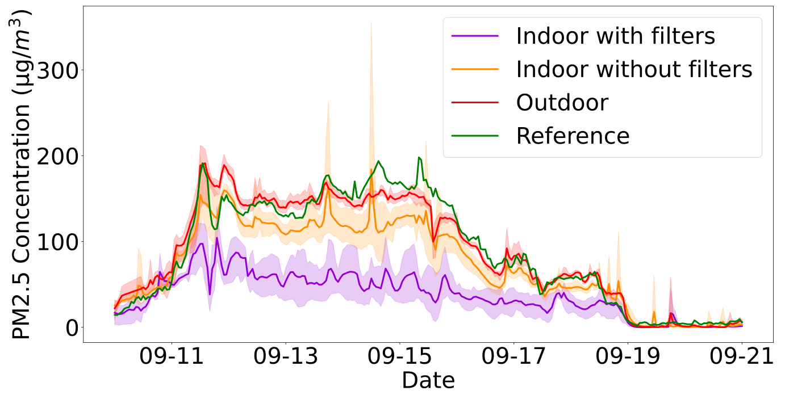

# AeroSpec-Project
The project aims to find the impact of wildfire to the air quality of our daily lives. My codes provide various time-series data analyses and visualizations to allow audience clearly see the effects of wildfire on PM2.5 concentrations.
Analysis folder include raw codes that help preprocess PM2.5 concentration data collected by our sensors. It also includes calibration code that helps calibrate our sensors' data to match Puget Sound Air's sensor data.
Figures folder include plots created by Python.
Reports include a PDF file that details the regresssion calibration.

We used our own sensors to place in 7 different locations. In addition, a sensor was given a person to wear it and take it with him during the wildfire.

Below are some results from my analysis:
 
 

 
 
The above plot shows the time-series line plots of indoor sensors, outdoor sensors, and reference sensors (Puget Sound Air sensors). Note that 9/10-9/19 is when the wildfire was occurring. From this plot we see that our outdoor sensor data matches that of the reference sensors, and indoor sensors without any HEPA filters have similar trend to outdoor sensor data.
 
 

 
 
The above plot shows the Indoor/Outdoor ratios of each location during and after wildfire.
 
 

 
 
The above plot shows the PM2.5 concentration collected by the sensor worn by a person. The person lived in Location 2 so the data was compared with Location 2's sensors. Note that there were 2 sensors placed at Location 2, and both sensors were next to a HEPA filter.
